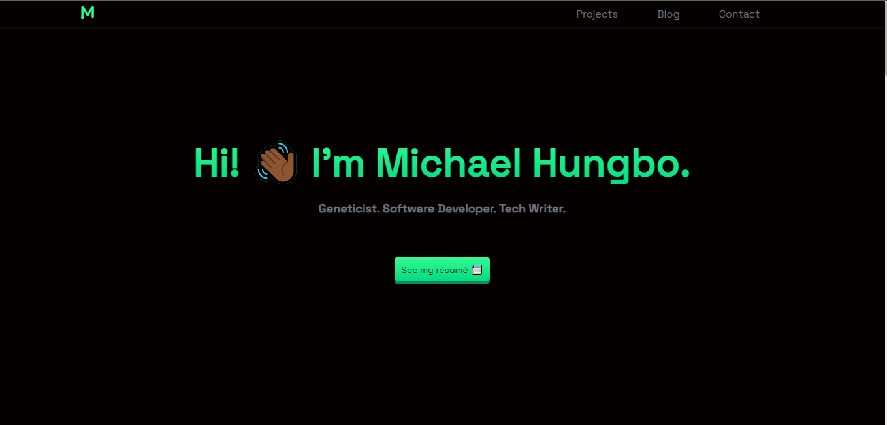

<p align='center'>

</p>

<p align='center' style='font-size:50px'>My Portfolio Website</p>

<br/>

## Contributing

Clone this repository and run the following command to install the project's dependencies.

```bash
yarn install 
# or 
npm install
```

Next, run the development server:

```bash
npm run dev
# or
yarn dev
```

Open [http://localhost:3000](http://localhost:3000) with your browser to see the result.

You can start editing the page by modifying `pages/index.tsx`. The page auto-updates as you edit the file.

